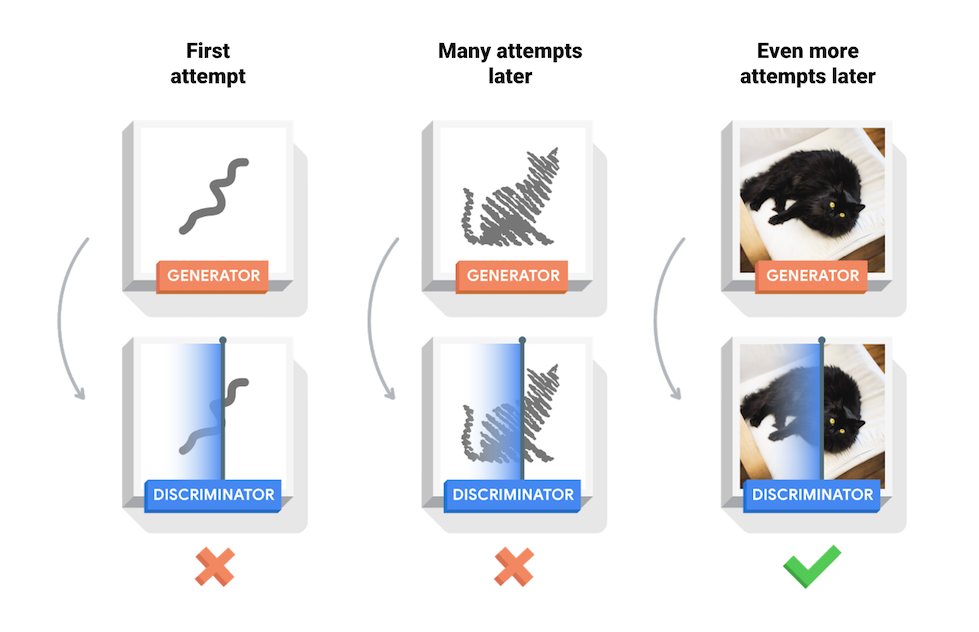
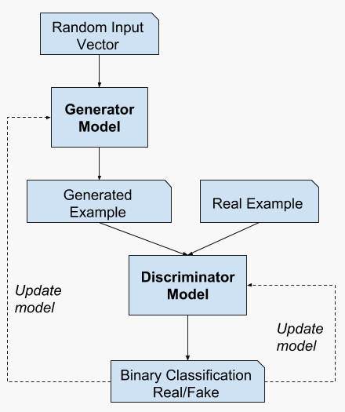
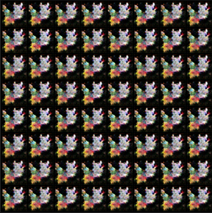

## Made by Arnaud PIGNEROL and Louis TARDY
 

# Abstract

    

    This project was made for a school project. It consists of training a DCGAN (Deep Convolutional Generative Adversarial Network) in order to generate new pokémon. The generation may not have been very performant but we can see their shape and colors are quite correct when we specify a unique Pokemon type. The result cannot be as perfect as real Pokemon because the DCGAN does not create the outlines of a Pokemon, therefore the created ones will seem weird.
    

  

# Introduction

To conclude our Deep Learning course, we had to choose a project inside a pool of subjects. We chose to get a dataset from kaggle and do some work on it. The chosen <a link = https://www.kaggle.com/kvpratama/pokemon-images-dataset>dataset</a> is about Pokemon and how to generate new ones. The usual way to deal with the generation of pictures based on real ones is by doing a GAN (Generative Adversarial Network) or more precisely a DCGAN (Deep Convolutional GAN). The difference between both is that a DCGAN is a direct extension of the GAN, except that it explicitly uses convolutional and convolutional-transpose layers in the discriminator and generator, respectively.

  

# Concept & Models

## About GANs and DCGANs

Before talking about DCGANs, let's do a small explanation about GANs. They are separated into two parts: the generator and the discriminator. The aim of the generator is to create fake contents similar enough to the real ones to pass throught the discriminator. The aim of the discriminator is to detect only the real contents. A feedback is then sent to the generator for it to learn what it did wrong and create better fake contents to deceive the discriminator.

    

As mentioned before, the DCGAN is an extension of the GAN working mainly with images that has the same goal and general structure as a normal GAN but with a couple modifications within the layers. The discriminator is composed differently of a regular GAN as it uses strided convolution layers, batch norm layers, and LeakyReLU activations. The generator is made of convolutional-transpose layers, batch norm layers, and ReLU activations.

 

## How DCGAN works

Now that we understood what is a DCGAN and why we are using it, we need to understand how to implement it, and so the theory behind it. As we said before, the DCGAN is split between a generator and a discriminator, so we will have to create both.

The generator take vectorized pictures as an input and creates new vectorized pictures based on the information the real ones gave to it. The outputs are vectorized pictures which combines the real ones and the generated ones. The discriminator takes vectorized pictures as an input and determines if they are real or fake ones. To do so we have to do a binary classification. The picture below explains how it is supposed to work.

    
    

 

Finally, we have to understand how they work together. Firstly we need to generate fake pictures with our generator. Then we give the generated pictures and the real ones to the real ones to the discriminator for it to determine which pictures are real and which are not. Finally, we update the discriminator and the generator based on the result of the discriminator. We continue as long as it is necessary.

    

  

# Methods & Results

We can now implement the theory into our code. First of all, we have added the last Pokemon pictures into our dataset, to have more images to train onto. Then we split the pictures by the Pokemon types, to see if we can generate more precise pictures of Pokemon (a pattern of colors and shapes exists for each type). Finally, we do apply the DCGAN to see how great our fakemons (fake Pokemon) are.

The splitting by types created a problem : there were not enough pictures for the deep learning to work. To prevent that, we created a while loop, creating temporary real pictures, by duplicating and mirroring vertically the already existent pictures. Thanks to that, the deep learning could work but the risk of overfitting was amplified. We stated we need at least 400 pictures to be able to train the model.

The dataset where all pictures were saved had a lesser risk to overfit, because of the diversity of pictures, but we may need a lot of epochs to have a good model, because of the diversity of pictures.

 

## Overfit
### Bug (the type, not a real bug)

The bug type have 94 existing Pokemon, so we had to duplicate the pictures to have enough. We trained it with 1000 epochs in the hope to get some beautiful fakemons. However, it seems we had trained it too much on a dataset with too much really similar pictures. Indeed, the generator seemed to have found the best picture possible to deceive the discriminator, but we wanted to have more than one fakemon generated, so 1000 epochs for so little pictures is too much.

 

    

 

## Underfit
### Fairy (the type, not a real fairy)

In comparison to the bug type, the fairy type is represented by 65 Pokemon. In order to prevent ourselves from the overfitting obtained with the bug type, we reduced the number of epochs to 500. However, we obtained an underfitting model. Indeed, the generator is not capable of creating pictures with shape and color at this stage, so we need to find a number of epochs between 500 and 1000 for the types with not enough representatives.

 

    

 

## Correct fit
### All

For the dataset containing all the Pokemon with all their forms, we have 1089 pictures. With this much images we decided to train on 500 epochs, which seemed enough to have a functionnal generator, creating shapes and colors of fakemon occasionnaly similar to real Pokemon. There are still some differences, for example the lack of outlines.

 

    

 

### Grass

After focusing on one type where the training worked correctly, we could observe significantly better results on the grass type, even more than when we had all pokemon types grouped together. Indeed, the general shape and color look much better for that type than every other type. If we look for a reason behind it, it looks like that for the 123 existing images for this type, more attributes are shared as all grass pokémons have a real plant-related inspiration source which would make the training easier, whereas for the normal types there could be various animals behind the pokemons that resulted from it. 

 

    

  

# Conclusion

To conclude this project, it is quite obvious that the generated result got approximatively close to the original images but that's about it. If we look at the images from far away they may look like a real pokémon but they still aren't close to the original ones when we look at it closely. 

One of the evident reasons to that problem is that the data set size and the number of epochs, showing how it's quite easy to do overfit or underfit. What we could say as well is that all pokémons don't share something particular in common that would create a real "identity" around them as each pokémon has its own inspiration. This is also why we see such different forms and colors when we try to use the model on all types but that problem is less obvious when we focus on only one type (such as the grass type) where the sources of inspirations behind each pokemon may still share more attributes in common. 

For more information about our project, here is the <a link = https://github.com/Tr4hern/Deep_Learning>github</a> link. However, because the LFS add-on limits the size of large files we can put on our git, we could not put more than one on it, and we put the only good one we had at the moment : the electric one.

